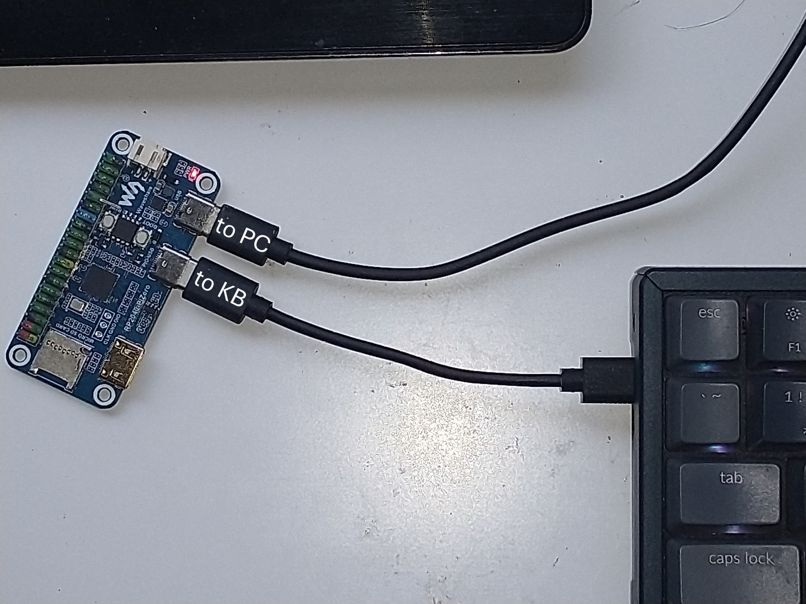

###### Hardware used:

[waveshare RP2040-PiZero](https://www.waveshare.com/wiki/RP2040-PiZero)

onboard USB in

GPIO pin 6 pin 7 connected to USB out

_no bluetooth, 2.4ghz_
_wired only_

###### Software used:

Arduino IDE 2.3.9

earlephilhower/arduino-pico  4.5.2

Adafruit TinyUSB  3.7.7

###### Objective:

1. Reimplement example sketch Adafruit TinyUSB Library/Dualrole/HID/hid_remapper.ino
2. Enumerate keyboard attached to GPIO and parse the HID report descriptor
3. extend functionality to also trigger callbacks on the HID reports produced by common media keys (back play forward mute vol- vol+)
4. change hid_remapper.ino as little as possible
5. work with all keyboards I have in front of me

###### Test devices:

Dell KB216

Keychron K4

Skyloong GK104

Keychron K10PRO

###### Test setup:

